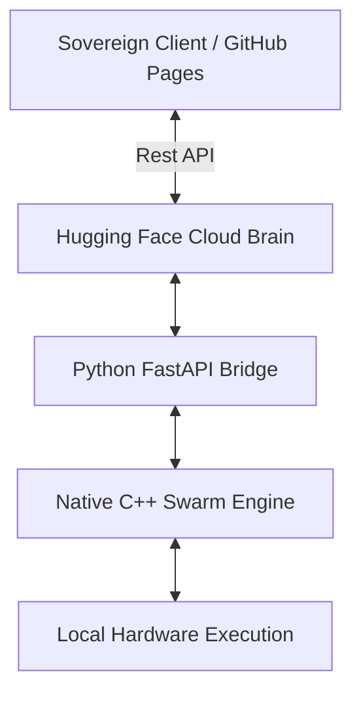

# SOVEREIGN SWARM Intelligence — [locallab.sbs]

> **The World’s Most Parameter-Efficient Autonomous Swarm.**
> High-performance Native C++ Engine with Real-time Cloud API Interface.

---

## 🏛️ ARCHITECTURE v2.0 (The Hybrid Cloud)

Sovereign is a hybrid platform designed for zero-latency local execution and global cloud accessibility.

### 1. The Sovereign Client (`/client`)
Live at **[locallab.sbs](https://locallab.sbs)**. A professional Next.js 15 dashboard designed to monitor and trigger agent interactions in real-time. Built with Glassmorphism and Lucide diagnostics.

### 2. The Cloud Brain (`/engine`)
A portable, ultra-efficient C++ reasoning unit wrapped in **FastAPI**. Deployable to any CPU-based infrastructure (e.g., Hugging Face Spaces) using the included `Dockerfile`.

---

## 🛠️ DEPLOYMENT INSTRUCTIONS

### 1. The Global Feed (`locallab.sbs`)
The frontend is automatically deployed to your custom domain via GitHub Actions upon every push to the `main` branch.

### 2. The Cloud Brain (Hugging Face)
To activate the simulation online:
1.  Create a new **Space** at [Hugging Face](https://huggingface.co/new-space).
2.  Select **Docker** as the SDK.
3.  Upload the contents of the `/engine` folder (including `Dockerfile`, `main.py`, and `sovereign_v9_swarm.cpp`).
4.  Once the build is green, update your `HF_SPACE_URL` in `client/src/components/InteractionFeed.tsx`.

---

## 🧭 PROJECT ROADMAP

Check the [Master Roadmap](./SOVEREIGN_ROADMAP.md) for current progress. 
Currently in **Stage 5 Refinement**, connecting the "Cloud Brain" to the interactive dashboard.

---

**© 2026 Sovereign Swarm Intelligence | [locallab.sbs]**
